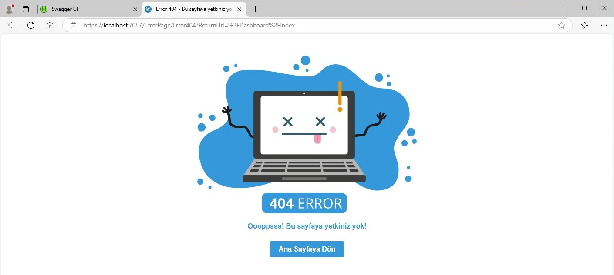

<h1 align="center">Gayrimenkul Arama Platformu</h1>

Bu projenin temel amacı, gayrimenkul sahibi olmayı hedefleyen kullanıcıların, istedikleri lokasyonlarda gayrimenkul arayışını kolaylaştırmak ve bu mülk sahipleriyle etkin bir iletişim kurmalarını sağlamaktır. Kullanıcı dostu bir arayüz ile desteklenen platform, alıcıların ihtiyaçlarına uygun mülkleri hızla bulmalarını hedeflemektedir.

<h2 align="center">Teknolojik Altyapı</h2>

Proje, **ASP.NET Core** teknolojisi kullanılarak geliştirilmiştir. Backend tarafında **Dapper ORM** ile veritabanı işlemleri gerçekleştirilmiş ve API tabanlı bir mimari oluşturulmuştur. Backend, tamamen RESTful API’ler üzerinden geliştirilmiş; bu sayede frontend tarafında bu API’ler kullanılarak zengin ve etkileşimli kullanıcı arayüzleri oluşturulmuştur.

<h2 align="center">Rol Atama ve Yetkilendirme</h2>

Kullanıcıların farklı rollerle (örneğin, admin ve kullanıcı) platformda yetkileri belirlenmiştir. Bu, yetkisiz erişimi önleyerek güvenli bir deneyim sunmaktadır.

<h2 align="center">Proje Mimarisi</h2>

Proje, folder structure ve **SOLID prensipleri**ne sıkı bir şekilde bağlı kalınarak geliştirilmiştir. Her modül, belirli bir işlevi yerine getirirken yazılımın bakımını ve genişletilebilirliğini artırmak amacıyla bağımsız olarak yapılandırılmıştır. Bu yaklaşım, proje içinde kod tekrarını en aza indirgemeyi sağlar.

<h2 align="center">İlan Yönetimi</h2>

Kullanıcılar, platform üzerinde kolayca gayrimenkul ilanları oluşturabilir ve bu ilanları yayınlayabilir. İlan detayları, kullanıcıların ilgisini çekecek şekilde zenginleştirilmiş ve görsellerle desteklenmiştir. Ayrıca, ilanlara yapılan yorumlar ve geri bildirimler, kullanıcı etkileşimini artırmak için entegre edilmiştir.

<h2 align="center">Kullanıcı Deneyimi</h2>

Kullanıcıların platformda rahatça gezinmesini sağlamak amacıyla, arayüz minimalist bir tasarım anlayışıyla geliştirilmiştir. Kullanıcılar, aradıkları gayrimenkul ilanlarına kolayca ulaşabilir ve detayları inceleyebilir. Ayrıca, ilave filtreleme seçenekleri ile arama süreçleri daha da özelleştirilebilmektedir.

<h2 align="center">Kullanılan Teknolojiler</h2>

### Web Geliştirme
- **ASP.NET Core 8.0 MVC**
- **Web API**
- **RESTful API**

### Veri Tabanı
- **MSSQL**
- **Dapper ORM (DB First)**
- **Trigger**

### Güvenlik
- **JWT (JSON Web Token)**
- **Rol Tabanlı Yetkilendirme**

### API Dokümantasyonu
- **Swagger**

### Kullanıcı Arayüzü
- **Bootstrap**

<h2 align="center">Sonuç</h2>

Bu proje, kullanıcıların gayrimenkul piyasasına daha etkin bir şekilde katılmasını sağlamak ve aradıkları mülkleri daha kolay bulmalarını hedeflemektedir. Aynı zamanda, gayrimenkul sahiplerinin ilanlarını geniş bir kitleye ulaştırabilmesi için güçlü bir platform sunmaktadır.

<h2 align="center"> Proje Görselleri </h3>

